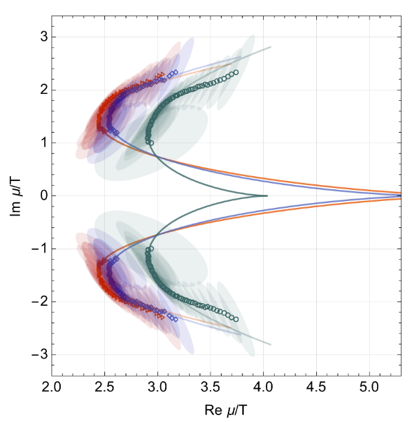
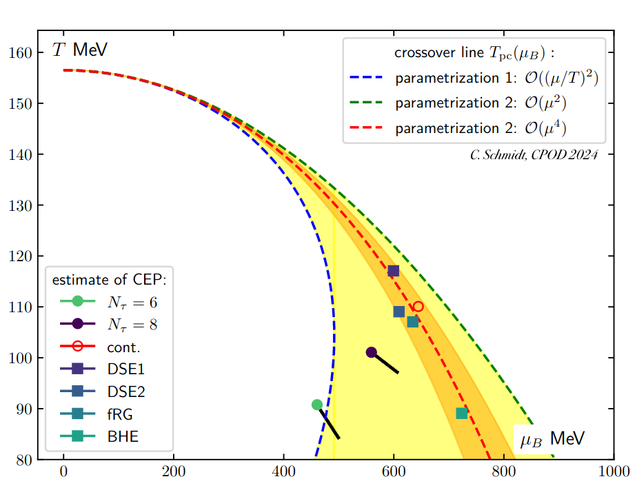

## Analytical structure of QCD

Vladi Skokov

North Carolina state University

---

### Yang-Lee edge singularity

--

### Illustration in Ising model

F. Rennecke, G. Johnson, and V.S.,     Phys.Rev.D 107 (2023) 11, 116013

- In contrast to the critical point, YLE form lines
- YLE are continuously connected to critical point

---

### Results: importance of fluctuations ($N$=1)

F. Rennecke and V. S, Annals Phys. 444 (2022) 169010

---

### Results: Ising universality class $N=1$

$d$ does not have to be integer in FRG

| d                                | 1   | 2          | 3        | 4           |
| -------------------------------- | --- | ---------- | -------- | ----------- |
| $ \| z_c \| /R\_\chi^{1/\gamma}$ | 1   | 1.32504(2) | 1.621(4) | $3/2^{2/3}$ |

G. Johnson, F. Rennecke, and V. S, Phys.Rev.D 107 (2023) 11,
116013  
F. Rennecke and V. S, Annals Phys. 444 (2022) 169010  
A. Connelly, G. Johnson, F. Rennecke, and V. S, Phys.Rev.Lett. 125 19, 191602
(2020)  
$d=2$: H.-L. Xu and A. Zamolodchikov, JHEP 08 (2022) 057 H.-L. Xu and A.
Zamolodchikov, 2304.07886

---

### Arbitrary $N$, $d=3$

| N                                | 1           | 2           | 3           | 4           | 5            |
| -------------------------------- | ----------- | ----------- | ----------- | ----------- | ------------ |
| $ \| z_c \| /R\_\chi^{1/\gamma}$ | 1.621(4)(1) | 1.612(9)(0) | 1.604(7)(0) | 1.597(3)(0) | 1.5925(2)(1) |

G. Johnson, F. Rennecke, and V. S, Phys.Rev.D 107 (2023) 11,
116013  
c.f. F. Karsch, C. Schmidt, and S. Singh Phys.Rev.D 109 (2024) 1, 014508

---

### Tracing YLE in QCD

$$
  z = z_c \to \text{Re} \mu_{YLE} \propto (T_{RM}-T)^{\beta \delta}
$$

Christian Schmidt, et. al., 2401.07790

---

### Tracing YLE in QCD

Indirect methods to locate YLE was used: input from Im $\mu$ or Taylor series
expansion coefficients of $\ln Z$ at zero $\mu$

G. Basar, 2312.06952  
D. Clarke et. al., 2405.10196

C. Schmidt, CPOD 2024

---

### Conformal map

---

### Fourier coefficients

---

### Conclusions

- Analytic structure of QCD partition function:

  - extrapolate results obtained at zero or imaginary chemical potential to real values of $\mu$

  - locate critical point

- Study of analytic structure is a hard problem

  - as an illustration of this: universal location of YLE singularity was established only recently in 2-d and 3-d systems

  - we are only scratching the surface of the research in this direction

- There are very encouraging results on location of QCD CP coming from analysis of Lattice data

  - two existing studies use different lattice inputs (Taylor series coefficients, imaginary $\mu$ data) but produce similar estimates on the location of CP

  - to-do list: continuum limit, calculations at lower temperatures, ...
